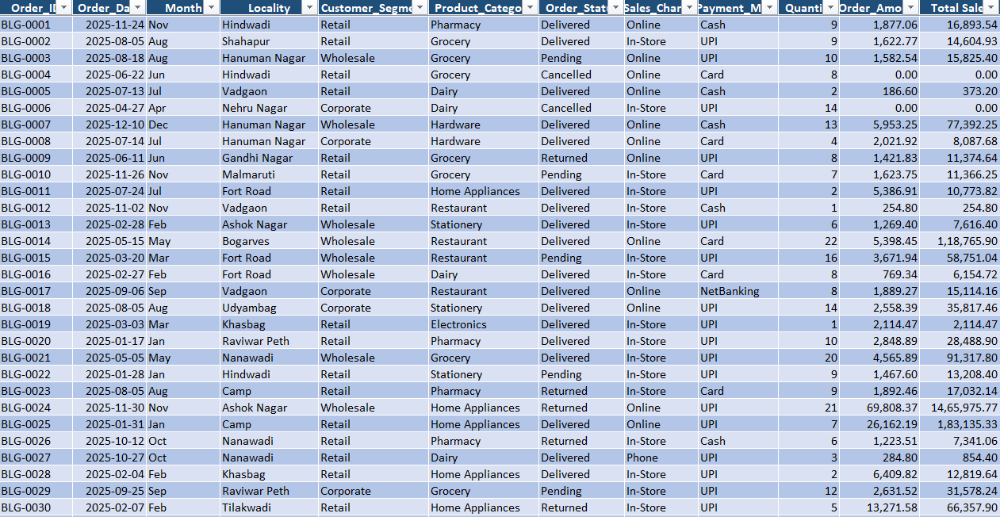
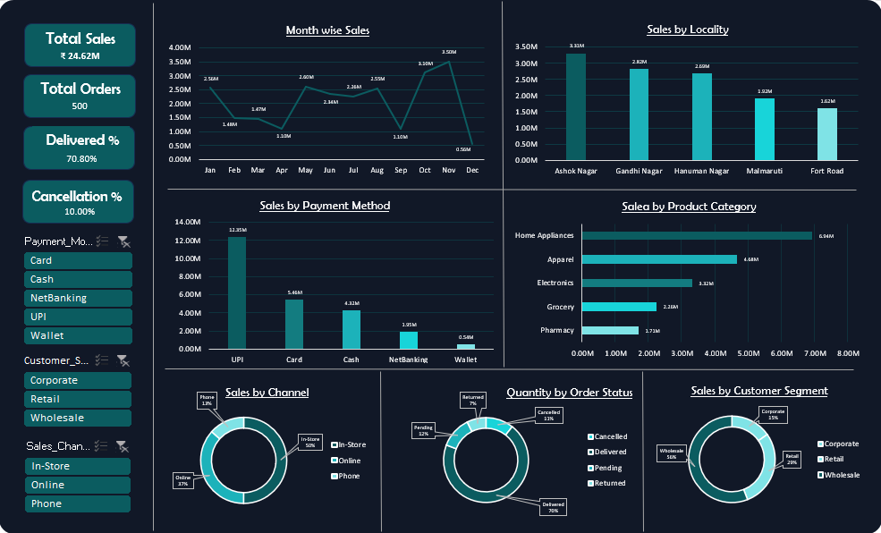

# Retail Sales Analysis Dashboard (Excel)

## Project Overview

This project analyzes retail sales data to identify key revenue drivers, customer behavior patterns, and operational performance across product categories, sales channels, and customer segments.

Using Microsoft Excel, the analysis focuses on uncovering insights that can help improve sales performance, optimize channel strategy, and reduce order cancellations.

An interactive dashboard was built using Pivot Tables, Charts, and Slicers to enable dynamic business decision-making.

---

## Executive Summary

This project analyzes retail sales data consisting of 500 orders and total revenue of ₹24.62M to identify key drivers of business performance.

The analysis highlights that revenue is highly concentrated in top product categories such as Home Appliances (₹6.94M) and Apparel (₹4.68M), while digital channels and payment methods (especially UPI contributing ₹12.35M) dominate customer transactions.

Operationally, 70% of orders are successfully delivered, but 30% remain cancelled, pending, or returned, indicating scope for process improvement.

Seasonal trends show peak sales in November (₹3.5M), suggesting strong event-driven demand.

The insights from this analysis can help businesses optimize product strategy, strengthen digital channels, improve order fulfillment, and align operations with demand patterns.

---

## Business Context

Retail businesses operate in a highly competitive environment where understanding customer behavior, sales performance, and operational efficiency is critical for growth.

With multiple product categories, sales channels, and customer segments, businesses need data-driven insights to identify revenue drivers, optimize inventory, and improve customer experience.

This project simulates a real-world retail scenario where transactional data is analyzed to uncover patterns in sales, customer preferences, and order fulfillment performance.

---

## Business Objective

The primary objective of this analysis is to transform raw retail transaction data into actionable insights that support business decision-making.

**Key objectives include:**

- Identify top-performing product categories and revenue drivers
- Evaluate sales channel performance and customer purchasing behavior
- Analyze order fulfillment efficiency (delivery vs cancellation trends)
- Understand payment preferences and digital adoption
- Detect seasonal trends and demand fluctuations
- Provide actionable recommendations to improve revenue and operations

---

## Dataset Preview

---

## Dataset Information

The dataset contains **500 retail orders** with the following attributes:

- Order ID
- Order Date
- Month
- Locality
- Customer Segment
- Product Category
- Order Status
- Sales Channel
- Payment Mode
- Quantity
- Order Amount
- Total Sales

---

## Dashboard

---

## Dashboard Metrics

The dashboard tracks the following KPIs:

- Total Sales  
- Total Orders  
- Delivered Percentage  
- Cancellation Percentage

---

## Dashboard Visualizations

The dashboard contains the following visual analysis:

- Month-wise sales trends
- Revenue distribution by locality
- Category-wise sales contribution
- Sales channel comparison
- Customer segment contribution
- Payment method usage
- Order status distribution

Interactive slicers allow dynamic filtering of the dashboard.

---

## Business Questions

### Revenue & Growth
- Which product categories contribute the highest share of total revenue?
- Which sales channels generate the most revenue and orders?

### Customer Behavior
- Which customer segments drive the highest sales value?
- What payment methods are most preferred by customers?

### Operations & Efficiency
- What percentage of orders are cancelled vs delivered?
- Are cancellations concentrated in specific channels or segments?

### Trends & Patterns
- How does sales performance vary month-over-month?
- Are there seasonal patterns in demand?
  
---

## Key Insights

### Revenue Drivers
- Home Appliances generated the highest revenue (₹6.94M), followed by Apparel (₹4.68M), indicating strong revenue concentration in top categories.

### Channel Performance
- In-store channel contributes the largest share (50%), significantly outperforming online orders (37%).

### Customer Segments
- Wholesale customers dominate revenue (~56%), showing heavy reliance on B2B sales.

### Payment Behavior
- UPI leads with ₹12.35M, accounting for over 50% of total transactions.

### Operational Efficiency
- 70% of orders were delivered, while 11% were cancelled, with ~19% in pending/returned status.

### Geographic Performance
- Ashok Nagar leads with ₹3.31M in sales, while Fort Road lags at ₹1.62M.

### Sales Trends
- Sales peak in November (₹3.5M) and drop sharply in December (₹0.56M), indicating strong seasonality.

---

## Business Recommendations

- Focus on high-performing categories (Home Appliances, Apparel) through targeted promotions and inventory expansion  
- Strengthen in-store sales channel with improved user experience and marketing investment  
- Reduce dependency on wholesale segment by expanding retail customer base  
- Promote digital payments (UPI, cards) through incentives and streamlined checkout  
- Improve order fulfillment processes to reduce cancellations and pending orders  
- Expand in high-performing localities while optimizing strategy in underperforming regions  
- Align marketing and inventory planning with seasonal demand patterns (peak in November)

---

## Conclusion

The analysis reveals that retail performance is strongly driven by a few high-performing product categories, a dominant wholesale customer segment, and increasing reliance on digital channels and payment methods.

While overall sales performance is strong, operational inefficiencies such as order cancellations and pending orders highlight opportunities for improvement.

Additionally, clear seasonal trends indicate the importance of aligning marketing and inventory strategies with demand cycles.

By leveraging these insights, businesses can enhance revenue growth, improve customer experience, and optimize operational efficiency.

---

## Next Steps / Future Analysis

While this analysis provides key insights into retail sales performance, further analysis can enhance decision-making:

- Perform channel-wise cancellation analysis to identify operational bottlenecks
- Analyze customer repeat purchase behavior to improve retention strategies
- Conduct profitability analysis by product category (not just revenue)
- Build sales forecasting models to predict future demand
- Analyze customer lifetime value (CLV) for different segments

---

## Tools Used

- Microsoft Excel  
- Pivot Tables  
- Pivot Charts  
- Slicers for Interactive Filtering

---

## Skills Demonstrated

- Business Data Analysis using Excel
- KPI Development & Performance Tracking
- Pivot Tables & Advanced Excel Analytics
- Dashboard Design & Data Visualization
- Customer & Revenue Analysis
- Translating Data into Business Insights
  
---

## File Included

dashboard.png

dataset_preview.png

retail_sales_analysis_excel.xlsx

---

## Project Structure

Retail-Sales-Analysis-Excel/
│
├── README.md
├── retail_sales_analysis_excel.xlsx
│
├── dataset_preview.png
└── dashboard.png

---

## How to Use

1. Download the Excel file.
2. Open the file in Microsoft Excel.
3. Navigate to the Dashboard sheet.
4. Use slicers to interactively explore the data.

---

## Repository Structure

- README.md - Project documentation including project overview, dataset information, dashboard explanation, insights, and recommendations.

- retail_sales_analysis_excel.xlsx - Excel workbook containing the dataset, data analysis, pivot tables, and the final sales dashboard.

- dataset_preview.png - Screenshot showing a preview of the dataset used in the analysis.

- dashboard.png - Screenshot of the final Excel dashboard visualizing retail sales performance.

---

## Author

Sarvesh Vernekar 
Aspiring Business / Data Analyst

